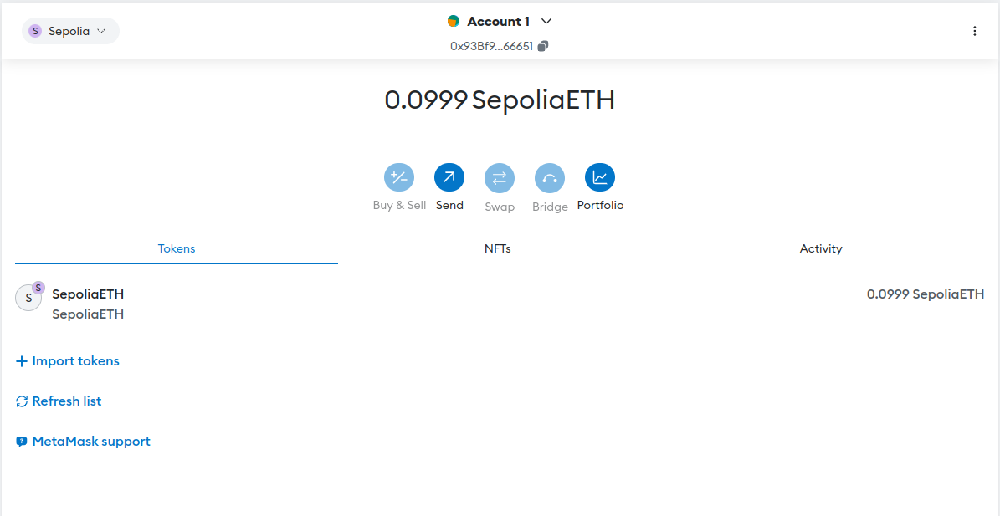
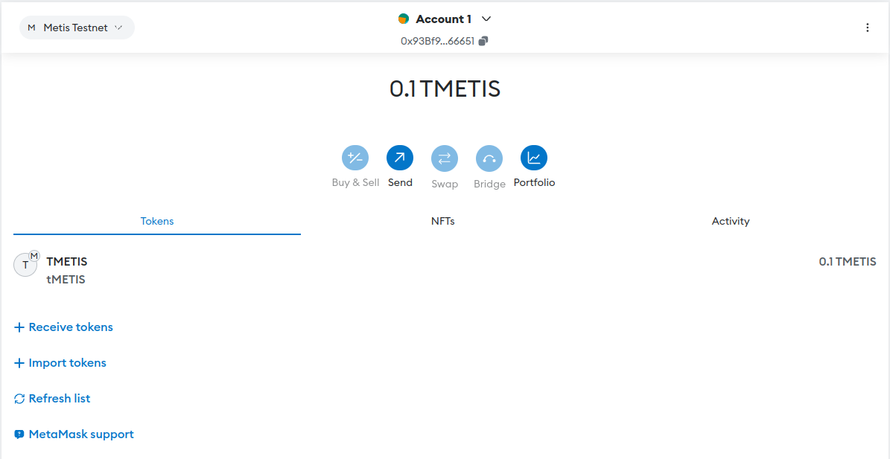

<h1 align="center">Solidity Mastery Program</h1>

<p align="center">
  
  
  
  
</p>

# Exercies 2

## 📄 Task 1: Try to faucet ETH on Sepolia



## 📄 Task 2: Try to faucet Metis on Metis L2



## 📄 Task 3: Deploy your first smart contract to Metis L2

- 📌 Link deployed: [Block hash](https://sepolia-explorer.metisdevops.link/address/0x93Bf9Ff7D63A5CF5421A105703f11566Dd866651)

```solidity
contract Lock {
    uint public unlockTime;
    address payable public owner;

    error InvalidUnlockTime(uint unlockTime, uint currentTime);
    event Withdrawal(uint amount, uint when);

    modifier onlyOwner() {
        require(msg.sender == owner, "You aren't the owner");
        _;
    }

    constructor(uint _unlockTime) payable {
        require(
            block.timestamp < _unlockTime,
            "Unlock time should be in the future"
        );

        unlockTime = _unlockTime;
        owner = payable(msg.sender);
    }

    function withdraw() public onlyOwner {
        // Uncomment this line, and the import of "hardhat/console.sol", to print a log in your terminal
        // console.log("Unlock time is %o and block timestamp is %o", unlockTime, block.timestamp);

        // require(block.timestamp >= unlockTime, "You can't withdraw yet");
        // require(msg.sender == owner, "You aren't the owner");

        if (block.timestamp < unlockTime) {
            revert InvalidUnlockTime(unlockTime, block.timestamp);
        }

        emit Withdrawal(address(this).balance, block.timestamp);

        owner.transfer(address(this).balance);
    }
}

```

- Network Config (hardhat.config.ts)

```js
networks: {
    "metis-testnet": {
        url: "https://sepolia.metisdevops.link",
        chainId: 59902,
        accounts: [PRIVATE_KEY],
        timeout: 2_147_483_647,
    },
},
```
