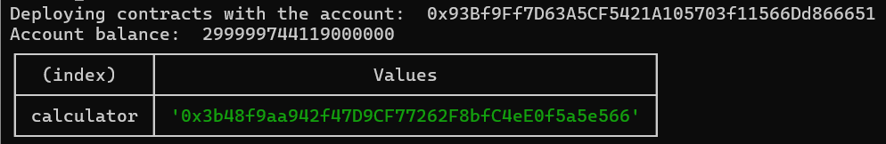

<h1 align="center">Solidity Mastery Program</h1>

<p align="center">
  
  
  
  
</p>

# Exercies 3

## 💬 Task 1: Make a contract called Calculator

## 💬 Task 2: Create Result variable to store result

## 💬 Task 3: Create functions to add, subtract, and multiply to result

## 💬 Task 4: Create a function to get result

## 💬 Task 5: Deploy to Metis L2



- 📌 Link deployed: [Block hash](https://sepolia-explorer.metisdevops.link/tx/0x1085368851a1c5c2724e6b11d0a35c49066da823ab1bb8200a58a231ebf37505)

### 💡 Solution

```solidity
// SPDX-License-Identifier: MIT

pragma solidity ^0.8.24;

contract Calculator {
    int256 private result;

    modifier check_b(int256 b) {
        require(b != 0, "You can't divide by zero");
        _;
    }

    function getResult() public view returns (int256) {
        return result;
    }

    function add(int256 a, int256 b) public {
        result = a + b;
    }

    function subtract(int256 a, int256 b) public {
        result = a - b;
    }

    function multiply(int256 a, int256 b) public {
        result = a * b;
    }

    function divide(int256 a, int256 b) public check_b(b) {
        result = (a * 10**18) / b;
    }
}
```

- Network Config (hardhat.config.ts)

```js
networks: {
    "metis-testnet": {
        url: "https://sepolia.metisdevops.link",
        chainId: 59902,
        accounts: [PRIVATE_KEY],
        timeout: 2_147_483_647,
    },
},
```

- Config deploy file (scripts/deploy.ts)

```js
import "@nomicfoundation/hardhat-ethers"
import { ethers } from "hardhat"

async function main() {
  const [owner] = await ethers.getSigners()
  console.log("Deploying contracts with the account: ", owner.address)
  console.log("Account balance: ", (await owner.provider.getBalance(owner)).toString())

  const deploy = async () => {
    const Calculator = await ethers.getContractFactory("Calculator")
    const calculator = await Calculator.deploy()

    console.table({
      calculator: await calculator.getAddress(),
    })
  }

  await deploy()
}

main()
  .then(() => process.exit(0))
  .catch((error) => {
    console.error(error)
    process.exit(1)
  })
```
